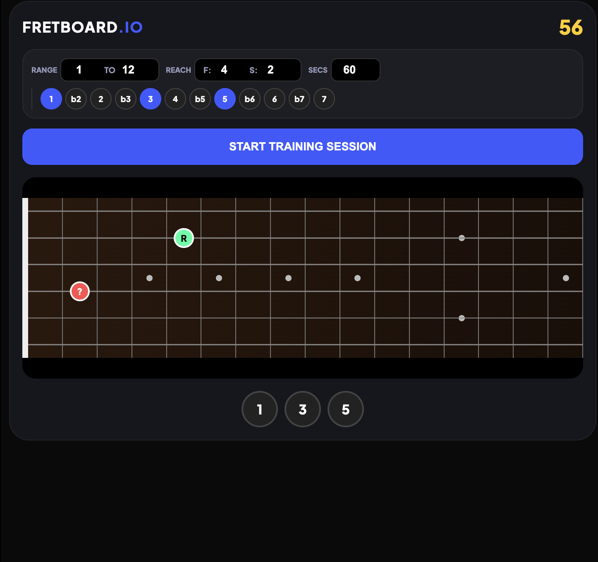

# Fretboard Master Pro 

**[Try It Now](https://jaizzer.github.io/scale-degree/)**

**Fretboard Master Pro** is a high-performance, minimalist web application designed for guitarists to master interval recognition, fretboard visualization, and harmonic geometry. By generating random "Root-to-Target" relationships based on custom constraints, it bridges the gap between theoretical knowledge and physical execution.




---

## 🎯 The Philosophy
Most fretboard trainers focus on simple note-naming (e.g., "Where is C?"). While useful, this doesn't help you during a solo. **Fretboard Master Pro** focuses on **Intervalic Relationships**. By practicing the distance between a Root and a Target, you develop a "mental map" of the neck that is independent of specific keys, allowing you to transpose licks and shapes instantly across the entire fretboard.

---

## 🚀 Key Features

### 🛠 Dynamic Training Configuration
* **Fret Range Control:** Target specific areas of the neck. Limit the trainer to the "Open Position" (Frets 1–5) or the "Dusty End" (Frets 12+).
* **Reach Constraints:**
    * **F (Fret Reach):** Limits how many frets away the target note can appear.
    * **S (String Reach):** Limits how many strings away the target can appear (e.g., set to `1` for adjacent string practice).
* **Custom Interval Sets:** Toggle specific scale degrees (1, b2, 2, b3, 3, etc.) to practice everything from basic triads to exotic bebop scales.

### 🧠 Intelligent Logic & Persistence
* **Collision Avoidance:** The generation algorithm ensures the "Target" and "Root" never occupy the same coordinate.
* **State Persistence:** Powered by `localStorage`. Your range, reach, session time, and active scale degrees are saved automatically—no need to re-configure every time you refresh the page.
* **Web Audio Feedback:** Uses the Web Audio API to synthesize distinct tones for "Correct" (Sine 700Hz) and "Incorrect" (Square 150Hz) responses.

### 📱 Modern, Responsive UI
* **Glassmorphism Design:** A sleek, dark-mode interface optimized for high focus.
* **Touch Optimized:** Large "Answer Buttons" and "Degree Chips" designed for easy use while holding a guitar.
* **Authentic Fretboard:** Includes standard marker dots (3, 5, 7, 9, 12, 15) to help you orient yourself at a glance.

---

## 🕹 How to Use

### 1. Set Your Bounds
Before starting, adjust your **Range** and **Reach** in the configuration bar.
* **Beginner Tip:** Set Range to `1-5` and Reach to `F:3 / S:1`.
* **Advanced Tip:** Set Reach to `F:12 / S:5` to practice large "skipping" intervals across the whole neck.

### 2. Select Your Scale Degrees
Click the circular chips in the configuration bar. Active degrees are highlighted in blue. For example, to practice Major Triads, select `1`, `3`, and `5`.

### 3. Identify the Note
Click **START TRAINING SESSION**.
* Locate the **Green (R)** note—this is your anchor.
* Observe the **Red (?)** note.
* Calculate the interval based on the distance and string offset.

---

## 📐 Technical Deep-Dive

### Interval Mapping
The application calculates semi-tone distances based on standard guitar tuning (E2-A2-D3-G3-B3-E4). The string offsets are mathematically represented as:
$$[24, 19, 15, 10, 5, 0]$$


The logic for calculating the interval $d$ between a Root $(rs, rf)$ and Target $(ts, tf)$ is:
$$\text{diff} = (Offsets[ts] + tf) - (Offsets[rs] + rf)$$
$$d = ((\text{diff} \pmod{12}) + 12) \pmod{12}$$

### Persistence Structure
Data is stored as a stringified JSON object in the user's browser `localStorage`:
```json
{
  "fLow": "1",
  "fHigh": "12",
  "fReach": "4",
  "sReach": "2",
  "sessionTime": "60",
  "activeDegrees": [0, 4, 7]
}